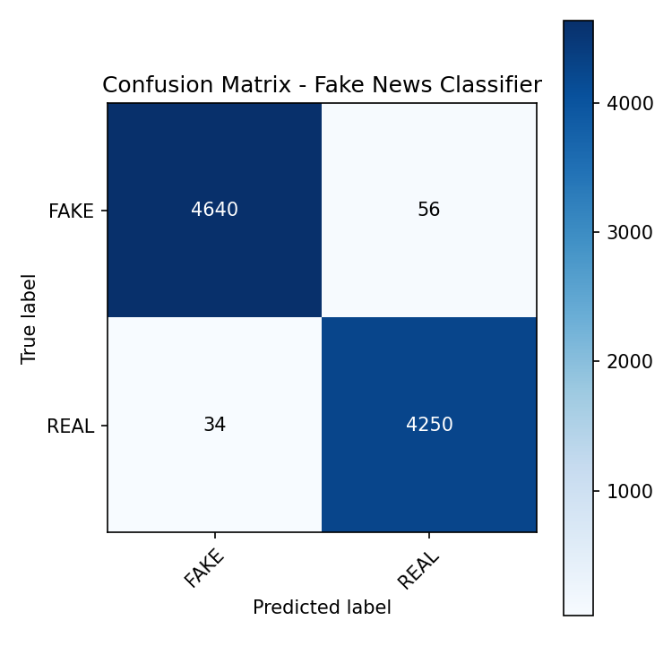

# 📰 Fake News Classifier (NLP)
### ✔️ TF-IDF + Logistic Regression | Streamlit UI | End-to-End NLP Pipeline

This project is a complete **Fake News Detection System** built using traditional NLP techniques:  
**TF-IDF Vectorization + Logistic Regression Classification**.  
A clean, production-style pipeline was implemented including: EDA, text cleaning, model training, evaluation, and deployment via a **Streamlit web interface**.

---

## ⭐ Key Features
- End-to-end NLP machine learning workflow  
- TF-IDF text vectorization  
- Logistic Regression classifier  
- High accuracy (99%)  
- Fully cleaned dataset (merged, labeled, processed)  
- Streamlit interactive web UI  
- Confusion matrix + classification report  
- Professional project structure  
- Easy to reproduce

---

## 📊 Model Performance (Important)

| Metric | Score |
|--------|--------|
| **Accuracy** | **99.0%** |
| Precision (Fake) | 0.99 |
| Recall (Fake) | 0.99 |
| Precision (Real) | 0.99 |
| Recall (Real) | 0.99 |

### Confusion Matrix

|                | Pred FAKE | Pred REAL |
|----------------|-----------|-----------|
| **Actual FAKE** | 4640      | 56        |
| **Actual REAL** | 34        | 4250      |

### Visualization  
<p align="center">
  
</p>

---

## 📁 Project Structure

```bash
fake-news-classifier/
│
├── data/
│
├── models/
│   └── fake_news_logreg.pkl
│
├── results/
│   ├── metrics_report.txt
│   ├── confusion_matrix_fake_news.png 
│   ├──Fake.png
│   └── True.png
│   
│
├── src/
│   ├── 01_eda_fake_news.py
│   ├── 02_clean_text.py
│   ├── 03_train_baseline_model.py
│   ├── app_fake_news_ui.py
│
└── README.md
```
## 🚀 Train the Model
```bash
python src/03_train_baseline_model.py
```
### This script will:
Load and clean the dataset
Apply TF-IDF vectorization
Train Logistic Regression
Evaluate on test split
### Save:
fake_news_logreg.pkl
confusion matrix
metric reports

## 🧪 Run the Streamlit App (UI)
```bash
streamlit run src/app_fake_news_ui.py
```

### Features:
Input any news paragraph
Text is cleaned using the same pipeline used in training
### Shows:
Predicted label (FAKE or REAL)
Probabilities for each class

## 🎬 Demo
<p align="center">
  
  
</p>

